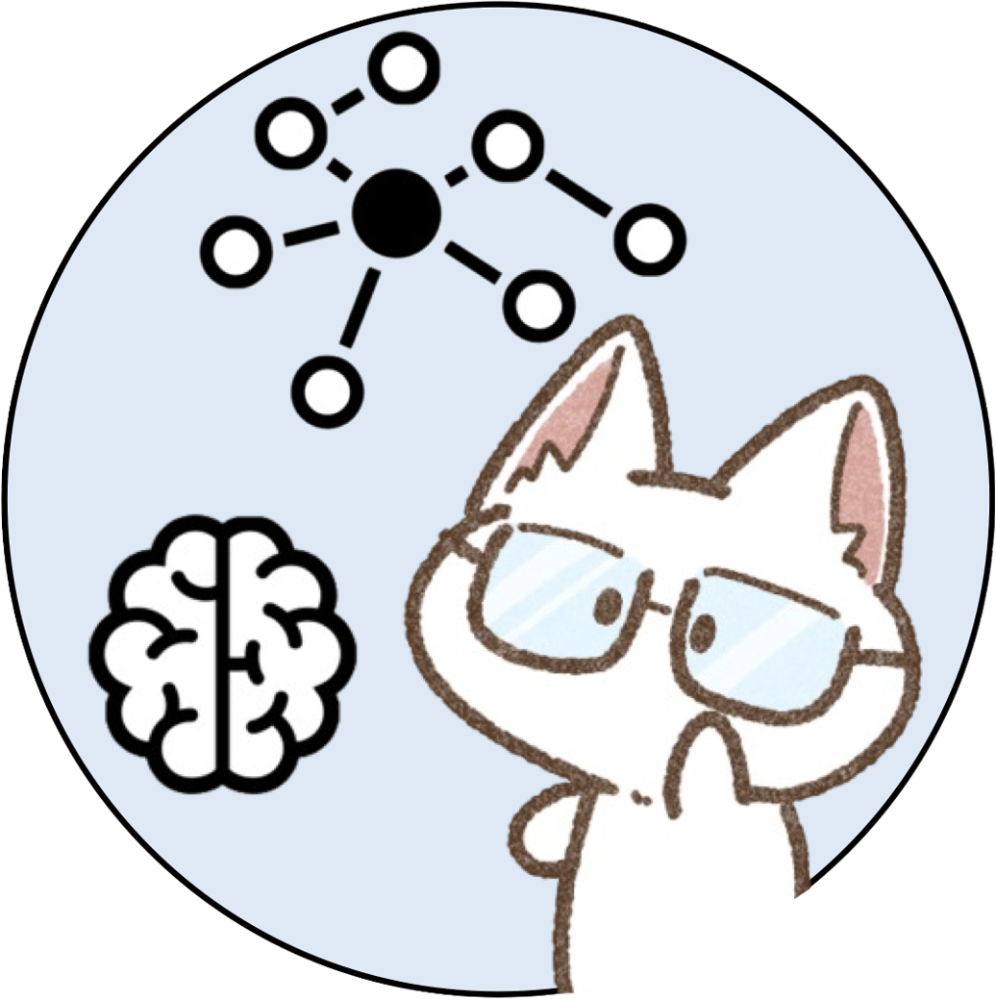
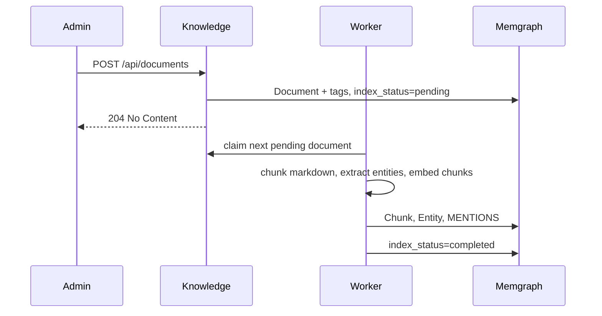
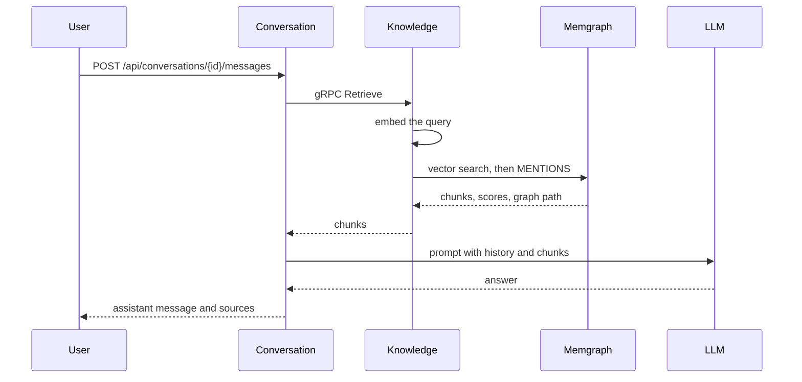

<a id="readme-top"></a>

[![MIT License][license-shield]][license-url]


<br />
<div align="center">
  <a href="https://github.com/kimnattanan/graph-rag-service">
    
  </a>

  <h3 align="center">Graph RAG Service</h3>
  
  <p align="center">
    Answer questions from a knowledge graph. Documents are chunked, embedded, and linked to the entities they mention, then retrieved over vector search and graph hops.
    <br />
    <a href="https://github.com/ThreeDotsLabs/wild-workouts-go-ddd-example"><strong>Structure reference »</strong></a>
    <br />
    <br />
    <a href="https://github.com/kimnattanan/graph-rag-service/issues/new?labels=bug">Report Bug</a>
    &middot;
    <a href="https://github.com/kimnattanan/graph-rag-service/issues/new?labels=enhancement">Request Feature</a>
  </p>
</div>


<details>
  <summary>Table of Contents</summary>
  <ol>
    <li>
      <a href="#about-the-project">About The Project</a>
      <ul>
        <li><a href="#user">User</a></li>
        <li><a href="#knowledge">Knowledge</a></li>
        <li><a href="#conversation">Conversation</a></li>
        <li><a href="#layout">Layout</a></li>
        <li><a href="#built-with">Built With</a></li>
      </ul>
    </li>
    <li>
      <a href="#getting-started">Getting Started</a>
      <ul>
        <li><a href="#prerequisites">Prerequisites</a></li>
        <li><a href="#installation">Installation</a></li>
      </ul>
    </li>
    <li><a href="#usage">Usage</a></li>
    <li><a href="#license">License</a></li>
  </ol>
</details>


## About The Project

Documents live in [Memgraph](https://memgraph.com/). A worker splits each one into chunks, names the entities in a single chat completion, and stores embeddings on the chunks. When someone asks a question, Conversation calls Knowledge, which embeds the question, runs a vector search, and returns the nearest chunks together with the entities they mention. Conversation then asks an LLM to answer from those passages and stores the sources.

The layout follows [Wild Workouts](https://github.com/ThreeDotsLabs/wild-workouts-go-ddd-example). Each bounded context is a clean-architecture service: the domain sits in the middle, application handlers depend only on that domain, and HTTP, gRPC, and databases sit at the edge. Writes and reads are separate CQRS handlers. The services talk to each other instead of sharing a database.

* **Domain-driven design.** User, Knowledge, and Conversation are separate contexts. Aggregates protect their own state changes, including the document index lifecycle (`pending`, `indexing`, `completed`, `failed`).
* **Clean architecture.** Domain code does not import Memgraph, Postgres, HTTP, or the LLM. Those are adapters. `ports` translate a transport into a command or a query, and `service` is the composition root that wires the adapters in.
* **CQRS.** A command changes state and returns no body (`POST /api/documents` answers `204`). A query only reads (`POST /api/retrieve`, `GET /api/documents/{id}`). Handlers live in `app/command` and `app/query`.
* **Graph RAG.** A chunk hit is returned with the entities it mentions, so an answer can show the graph path behind a passage.
* **Vector embedding and search.** One embedding model writes chunk and entity vectors and embeds the question at query time. Memgraph holds a cosine vector index on `Chunk.embedding`.
* **Auth, access control, gRPC, and jobs.** The user service issues a JWT that carries role and permissions. HTTP handlers enforce those permissions. Conversation calls Knowledge over gRPC. A worker in the Knowledge process indexes documents, embeds entities, and deletes orphaned graph nodes.

An admin creates a markdown document. The HTTP handler stores it as `pending` and returns. The worker later chunks the markdown, names entities, embeds the chunks, and writes the graph.



A user then asks a question. Conversation loads recent messages, calls Knowledge `Retrieve`, and completes the prompt with the LLM.



Each context is its own Go module under `internal/`, with its own `main`, database, and API. `internal/common` holds the shared server, JWT helpers, errors, and generated clients.

### User

Accounts and sessions. Register creates a `user`. Startup can seed one `admin` from the environment. Login returns a bearer token. Permissions come from the role and are stored in the token. Other services do not call User to authorize a request. They verify the JWT themselves.

| Role | Permissions |
| --- | --- |
| `user` | `conversation:ask` |
| `admin` | `knowledge:write`, `conversation:ask` |

HTTP is on `127.0.0.1:3001`. Routes live under `/api` (`/auth/register`, `/auth/login`, `/auth/logout`, `/users/me`).

### Knowledge

Documents and the graph built from them. This context owns indexing and retrieval. It returns chunks. It does not answer the user.

A document points at its tags and its chunks. A chunk points at the entities named in that text.

```text
Document -[:TAGGED_AS]-> Tag
Document -[:HAS_CHUNK]-> Chunk
Chunk     -[:MENTIONS]-> Entity
```

[![Knowledge graph][graph-screenshot]](smoke_data/png/graph.png)

`POST /api/documents` writes the document and its tags, then stops. A worker inside the HTTP process claims pending documents, replaces their chunks, and moves the index status to `completed` or `failed`. A second loop embeds entities that do not yet have a vector. A sweep deletes chunks, entities, and tags that nothing points at.

`POST /api/retrieve` embeds the query, searches the chunk vector index, keeps documents that are `completed` and match the optional tags, and returns each chunk with a similarity score and the entity names on its `MENTIONS` edges.

Document writes require `knowledge:write`. Retrieve requires `conversation:ask`.

| Process | Host address | Role |
| --- | --- | --- |
| `knowledge-http` | `127.0.0.1:3000` | HTTP API and the indexing worker |
| `knowledge-grpc` | `127.0.0.1:3010` | gRPC API used by Conversation |

### Conversation

A user's chats. A conversation belongs to one user. Sending a message checks that ownership, stores the user message, retrieves chunks from Knowledge over gRPC, builds a prompt from recent history and those chunks, and stores the assistant reply with the sources.

| Process | Host address | Role |
| --- | --- | --- |
| `conversation-http` | `127.0.0.1:3002` | HTTP API |
| `conversation-grpc` | `127.0.0.1:3012` | gRPC API |

Routes live under `/api/conversations` and require `conversation:ask`.

### Layout

Dependencies point inward: `ports` and `adapters` depend on `app`, and `app` depends on `domain`.

```text
internal/<context>/
  domain/     aggregates, invariants, repository interfaces
  app/
    command/  CQRS write handlers
    query/    CQRS read handlers
  adapters/   Postgres, Memgraph, LLM, and embedding clients
  ports/      HTTP, gRPC, and the knowledge worker
  service/    composition root
  main.go
```

`api/openapi` describes the HTTP APIs. `api/protobuf` describes the gRPC APIs. Handlers are wrapped with logging and metrics decorators, so instrumentation sits outside the use case.

```sh
make openapi   # HTTP server interfaces and JS clients
make proto     # gRPC stubs
```

<p align="right">(<a href="#readme-top">back to top</a>)</p>


### Built With

* [![Go][Go]][Go-url]
* [![gRPC][gRPC]][gRPC-url]
* [![PostgreSQL][PostgreSQL]][PostgreSQL-url]
* [![Docker][Docker]][Docker-url]
* [Memgraph](https://memgraph.com/)
* [chi](https://github.com/go-chi/chi)

<p align="right">(<a href="#readme-top">back to top</a>)</p>


## Getting Started

The stack runs with Docker Compose. Chat and embeddings are an OpenAI-compatible API. The sample environment points at [Ollama](https://ollama.com/) on the host.

### Prerequisites

* Docker and Docker Compose
* An OpenAI-compatible chat model and embedding model. With Ollama:

  ```sh
  ollama pull llama3.1
  ollama pull all-minilm
  ```

  `VECTOR_EMBEDDING_DIMENSION` must be the dimension of the embedding model. `all-minilm` is `384`. That value is written into the Memgraph vector index on startup. To change it after chunks exist, drop the index and reindex the documents.

### Installation

1. Clone the repo
   ```sh
   git clone https://github.com/kimnattanan/graph-rag-service.git
   cd graph-rag-service
   ```
2. Create a local env file and set `JWT_SECRET` and `ADMIN_PASSWORD`
   ```sh
   cp .env.example .env
   ```
3. Start the services
   ```sh
   docker compose up --build
   ```

`KNOWLEDGE_WORKER_COUNT` stays `0` in `.env`. Compose sets it to `1` on `knowledge-http` only, so indexing does not also run inside `knowledge-grpc`.

Postgres data and the Memgraph store are Docker volumes. `docker compose down -v` deletes them.

<p align="right">(<a href="#readme-top">back to top</a>)</p>


## Usage

The admin account from `.env` can both write documents and ask questions. A registered user can ask, and cannot write documents.

1. Log in and keep the access token
   ```sh
   curl -s -X POST http://127.0.0.1:3001/api/auth/login \
     -H 'Content-Type: application/json' \
     -d '{"email":"admin@example.com","password":"change-me"}'
   ```
   The response field is `accessToken`. Use it as `$TOKEN` below.
2. Create a markdown document (`knowledge:write`). The id is chosen by the client. This returns `204` and leaves the document `pending`.
   ```sh
   curl -s -o /dev/null -w '%{http_code}\n' \
     -X POST http://127.0.0.1:3000/api/documents \
     -H "Authorization: Bearer $TOKEN" \
     -H 'Content-Type: application/json' \
     -d '{"id":"00000000-0000-4000-8000-000000000001","title":"Notes","content":"# Notes\n\nMemgraph stores the chunks.","tags":["notes"]}'
   ```
3. Poll until `status` is `completed`
   ```sh
   curl -s http://127.0.0.1:3000/api/documents/00000000-0000-4000-8000-000000000001/index-status \
     -H "Authorization: Bearer $TOKEN"
   ```
4. Create a conversation (`conversation:ask`). This also returns `204`.
   ```sh
   curl -s -o /dev/null -w '%{http_code}\n' \
     -X POST http://127.0.0.1:3002/api/conversations \
     -H "Authorization: Bearer $TOKEN" \
     -H 'Content-Type: application/json' \
     -d '{"id":"00000000-0000-4000-8000-000000000002","title":"Notes"}'
   ```
5. Send a question. Conversation retrieves chunks from Knowledge, calls the LLM, and stores both the user message and the assistant reply. `topK` is how many chunks to retrieve. `tags` limits retrieval to documents with those tags. `historyCapacity` is how many earlier messages go into the prompt.
   ```sh
   curl -s -o /dev/null -w '%{http_code}\n' \
     -X POST http://127.0.0.1:3002/api/conversations/00000000-0000-4000-8000-000000000002/messages \
     -H "Authorization: Bearer $TOKEN" \
     -H 'Content-Type: application/json' \
     -d '{"id":"00000000-0000-4000-8000-000000000003","content":"What does Memgraph store?","topK":5,"tags":["notes"],"historyCapacity":3}'
   ```
6. Read the conversation. The assistant message includes `sources`: document id, title, chunk text, and score.
   ```sh
   curl -s http://127.0.0.1:3002/api/conversations/00000000-0000-4000-8000-000000000002 \
     -H "Authorization: Bearer $TOKEN"
   ```

To try the same question as a normal user, register and log in, then repeat steps 4–6 with that token:

```sh
curl -s -o /dev/null -w '%{http_code}\n' \
  -X POST http://127.0.0.1:3001/api/auth/register \
  -H 'Content-Type: application/json' \
  -d '{"email":"user@example.com","username":"user","password":"change-me"}'
```

Memgraph Lab is on `127.0.0.1:8000`. This Cypher draws the current graph:

```cypher
MATCH p=()-[]-() RETURN p;
```

[![Conversation][conversation-screenshot]](smoke_data/png/conversation.png)

<p align="right">(<a href="#readme-top">back to top</a>)</p>


## License

Distributed under the MIT License. See `LICENSE` for more information.

<p align="right">(<a href="#readme-top">back to top</a>)</p>


[contributors-shield]: https://img.shields.io/github/contributors/kimnattanan/graph-rag-service.svg?style=for-the-badge
[contributors-url]: https://github.com/kimnattanan/graph-rag-service/graphs/contributors
[forks-shield]: https://img.shields.io/github/forks/kimnattanan/graph-rag-service.svg?style=for-the-badge
[forks-url]: https://github.com/kimnattanan/graph-rag-service/network/members
[stars-shield]: https://img.shields.io/github/stars/kimnattanan/graph-rag-service.svg?style=for-the-badge
[stars-url]: https://github.com/kimnattanan/graph-rag-service/stargazers
[issues-shield]: https://img.shields.io/github/issues/kimnattanan/graph-rag-service.svg?style=for-the-badge
[issues-url]: https://github.com/kimnattanan/graph-rag-service/issues
[license-shield]: https://img.shields.io/github/license/kimnattanan/graph-rag-service.svg?style=for-the-badge
[license-url]: LICENSE
[conversation-screenshot]: smoke_data/png/conversation.png
[graph-screenshot]: smoke_data/png/graph.png
[Go]: https://img.shields.io/badge/Go-00ADD8?style=for-the-badge&logo=go&logoColor=white
[Go-url]: https://go.dev/
[gRPC]: https://img.shields.io/badge/gRPC-244c5a?style=for-the-badge&logo=grpc&logoColor=white
[gRPC-url]: https://grpc.io/
[PostgreSQL]: https://img.shields.io/badge/PostgreSQL-4169E1?style=for-the-badge&logo=postgresql&logoColor=white
[PostgreSQL-url]: https://www.postgresql.org/
[Docker]: https://img.shields.io/badge/Docker-2496ED?style=for-the-badge&logo=docker&logoColor=white
[Docker-url]: https://www.docker.com/
